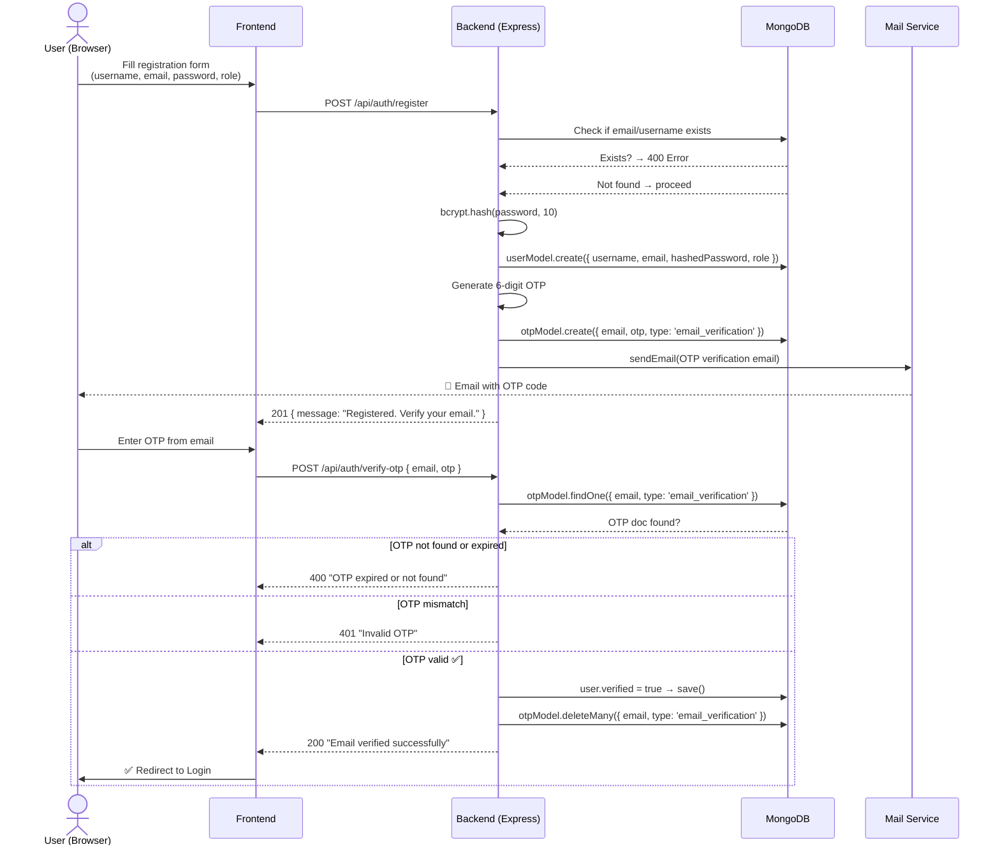
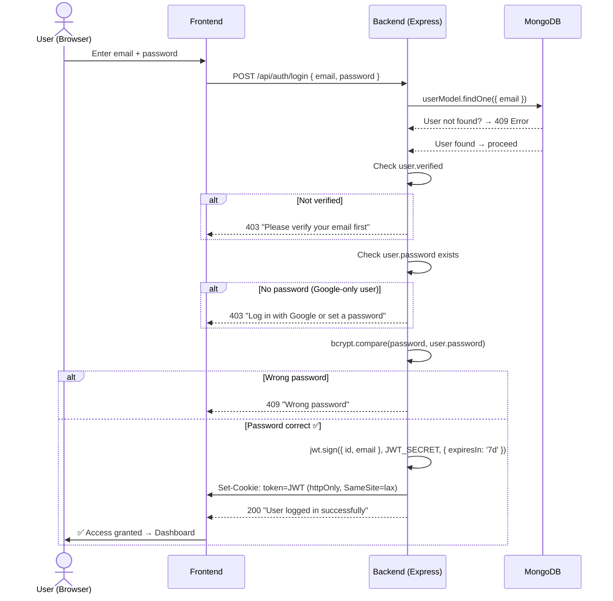
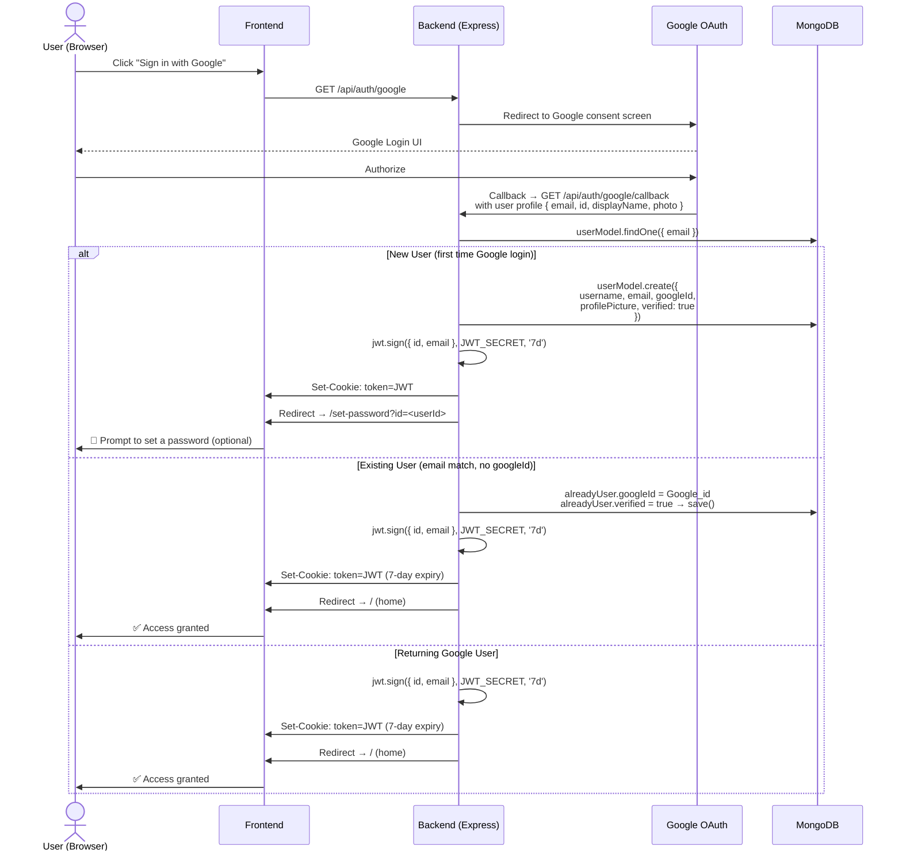
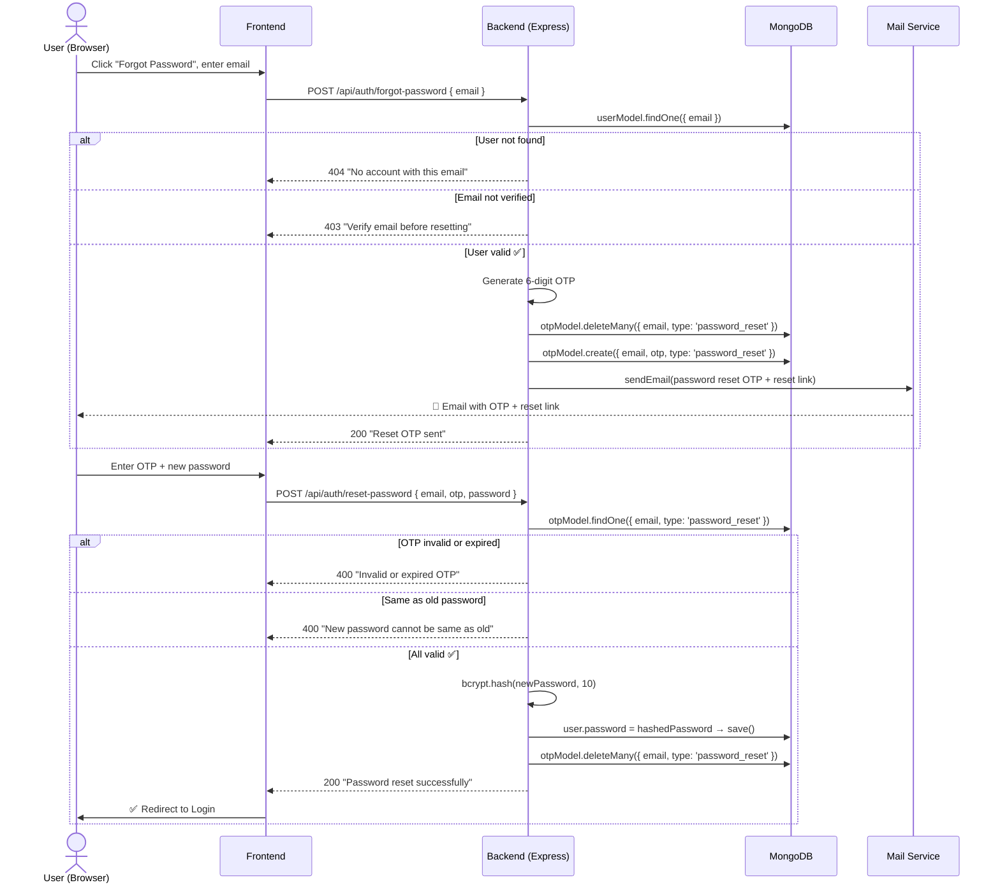
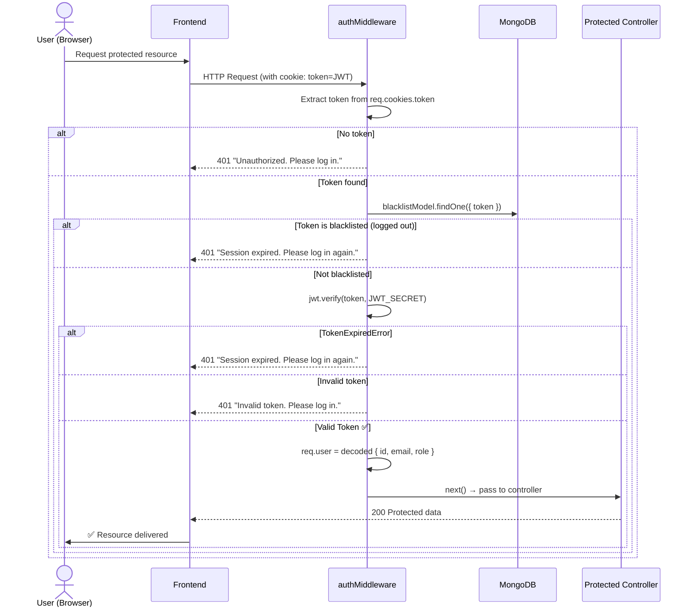
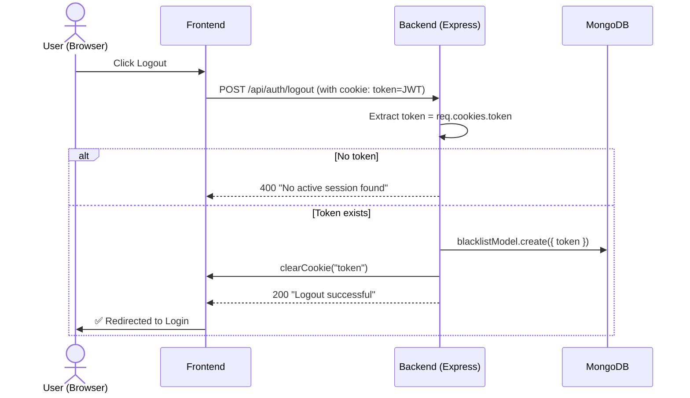
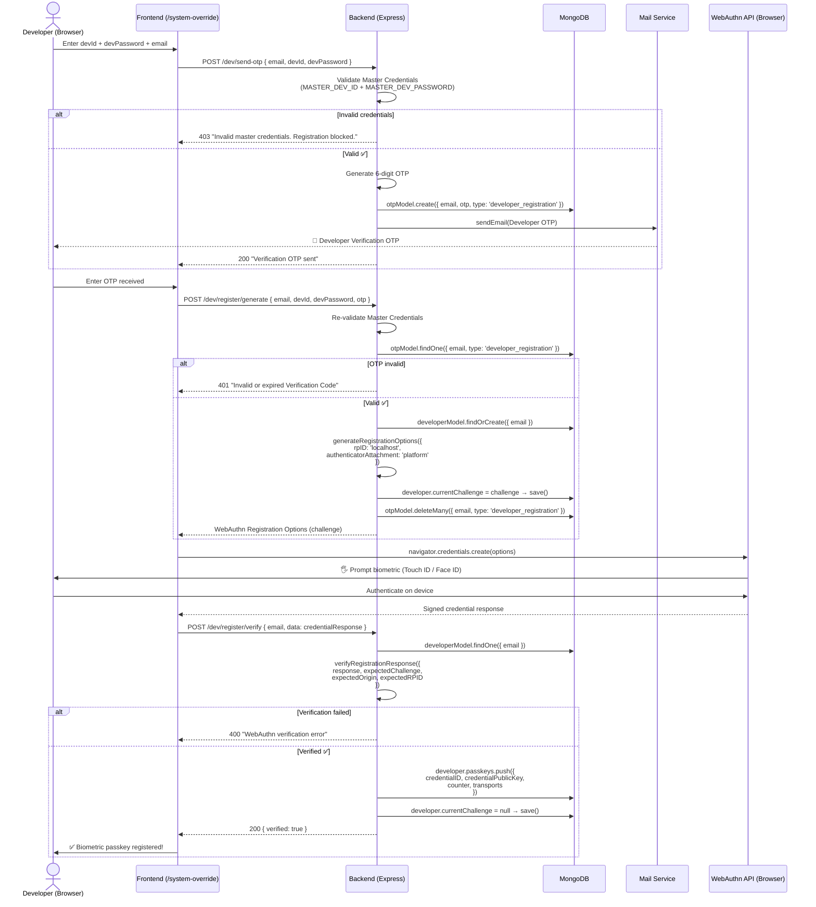
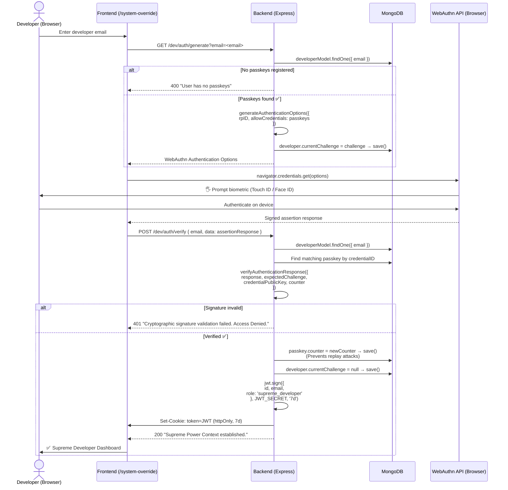
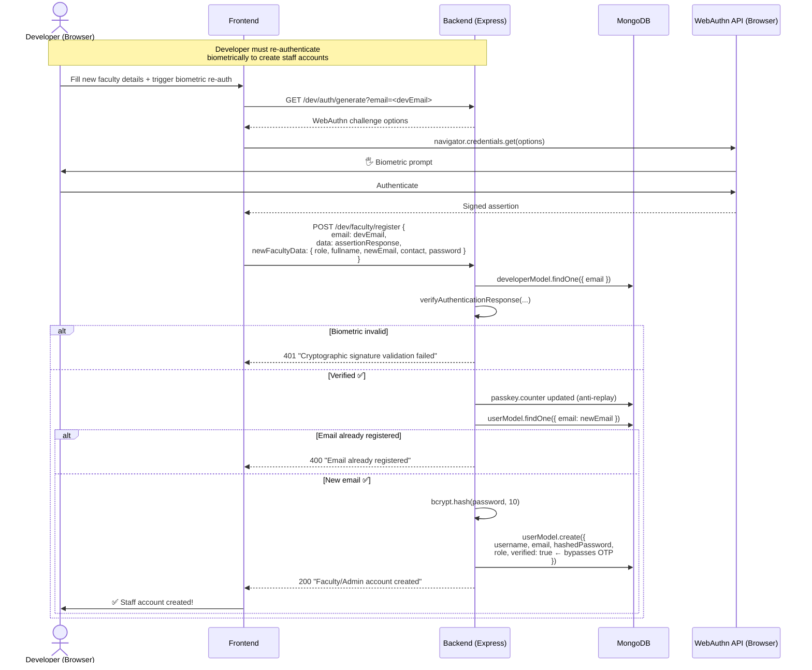
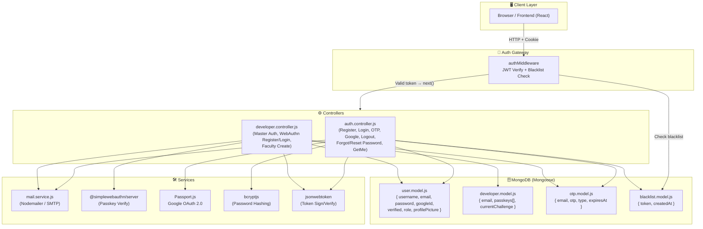

# 🔐 JssConnect — Authentication Architecture Flow

> A complete visual reference for all authentication paths in the system.

---

## 📋 Overview

JssConnect has **three distinct authentication tiers**:

| Tier | Actor | Method | Token Role |
|---|---|---|---|
| **1** | Student / User | Email + Password + OTP | `user` / `faculty` |
| **2** | Google OAuth | Google Sign-In | `user` (auto-verified) |
| **3** | Supreme Developer | Master Creds + Email OTP + WebAuthn Biometric | `supreme_developer` |

---

## 🗂️ Flow 1 — Standard Registration & Email Verification

---

## 🗂️ Flow 2 — Standard Login

---

## 🗂️ Flow 3 — Google OAuth Login

---

## 🗂️ Flow 4 — Forgot Password / Reset

---

## 🗂️ Flow 5 — Auth Middleware (Protected Routes)

---

## 🗂️ Flow 6 — Logout

---

## 🗂️ Flow 7 — Supreme Developer Auth (WebAuthn Biometric)

> This is the highest-privilege authentication tier. It uses a 3-factor flow:
> **Master Credentials → Email OTP → Hardware Biometric (WebAuthn)**

### Phase A — Developer Registration (One-time Passkey Enrollment)

### Phase B — Developer Login (Biometric Authentication)

---

## 🗂️ Flow 8 — Developer Creates Faculty / Admin Account

---

## 🏗️ System Architecture Overview

---

## 🔑 Key Security Properties

| Property | Mechanism |
|---|---|
| **Password Storage** | `bcrypt` with salt rounds = 10 |
| **Session Tokens** | HTTP-only, Secure, SameSite=lax cookies |
| **Token Revocation** | Blacklist model (invalidates JWTs on logout) |
| **Email Verification** | 6-digit OTP with 5-min TTL, max 3 resends |
| **Password Reset** | Separate OTP type (`password_reset`) |
| **Developer Identity** | 3-factor: Master Creds + Email OTP + WebAuthn |
| **Biometric Replay Attack Prevention** | WebAuthn counter incremented on every auth |
| **Passkey Storage** | `credentialPublicKey` stored as base64url in DB |
| **Faculty Provisioning** | Requires live biometric re-verification, bypasses OTP |
